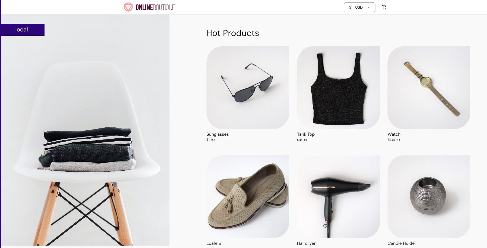

# Deploy microservices application

## Overview

- This hands-on will use the reference microservices from [GoogleCloudPlatform/microservices-demo](https://github.com/GoogleCloudPlatform/microservices-demo)

## Prerequisite

- Any local K8s cluster up and running (Docker Desktop/Minikube/kind/...)

## Steps

### 0-Check k8s cluster

If you have already installed kubectl and it is pointing to some other environment, such as minikube or a GKE cluster, ensure you change the context so that kubectl is pointing to docker-desktop:

```bash
kubectl config get-contexts
kubectl config use-context docker-desktop

# Now check the cluster
kubectl get nodes
kubectl cluster-info
```

### 1-Deploy application

```bash
kubectl apply -f https://raw.githubusercontent.com/GoogleCloudPlatform/microservices-demo/main/release/kubernetes-manifests.yaml
```

### 2-Access the application

Access the web frontend in a browser using the frontend's port-forwaring.

```bash
# check services
kubectl get svc

# forward
kubectl port-forward svc/frontend 8080:80
```

Now we can access: http://localhost:8080/ , result looks like:


### 3-Cleanup

Delete the app

```bash
kubectl delete -f https://raw.githubusercontent.com/GoogleCloudPlatform/microservices-demo/main/release/kubernetes-manifests.yaml
```
