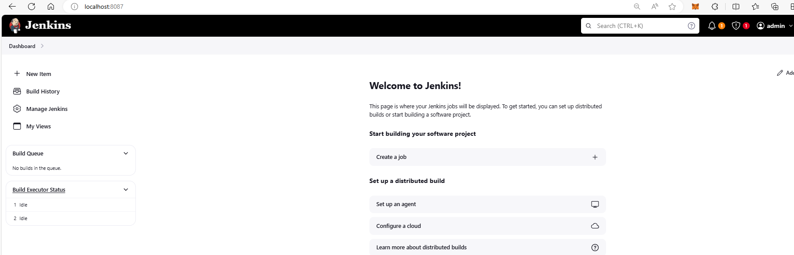
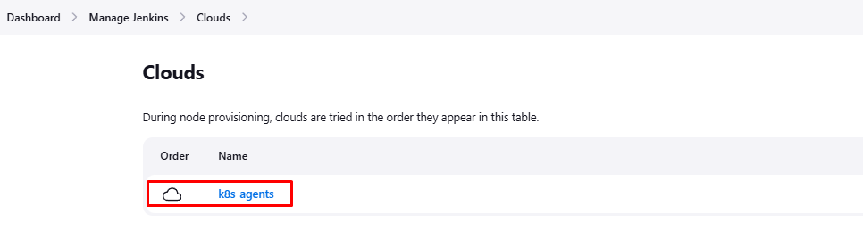
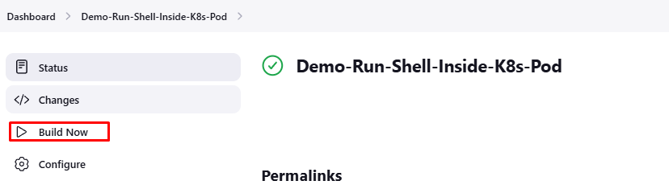
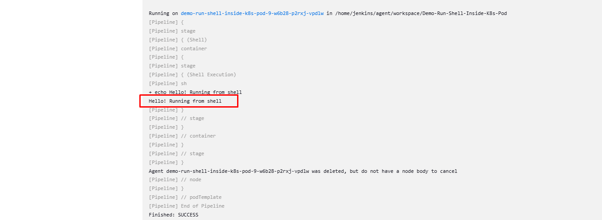
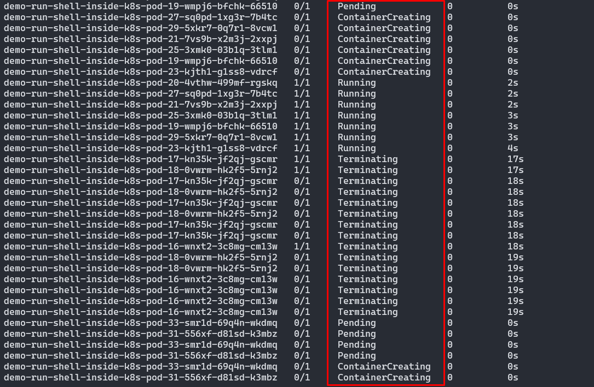

# Jenkins on k8s

In this hands-on, we'll cover:

- Deploy Jenkins controller on k8s cluster
- Configure k8s cluster as Jenkins agents
- Create and run a sample pipeline on a k8s Pod
- Watch the Pod life cycle for a pipeline run

## Document

- https://www.jenkins.io/doc/book/installing/kubernetes/

## Deploy Jenkins controller

### 1. Deploy

```bash
cd hands-on/jenkins-on-k8s
kubectl create namespace devops-tools

./deploy.sh
```

### 2. Port-forwarding

- Open new terminal and run:

```bash
# Note: You can also replace 8087 to the working PORT in your PC
kubectl port-forward service/jenkins-service -n devops-tools 8087:8080
```

### 3. Get initial password

Jenkins will ask for the initial Admin password when you access the dashboard for the first time.

```bash
# Get the Jenkins podname
kubectl get pods --namespace=devops-tools

# Given that we have <pod_name>, now cat the initialAdminPassword
kubectl exec -it <pod_name> cat /var/jenkins_home/secrets/initialAdminPassword -n devops-tools

# Sample output: d72493ce44fb48bc8833da94b40cdd68
```

### 4. Access the Jenkins

- Login to http://localhost:8087 (or another PORT suits with you PC you forward previously), with the initial password obtained from previous step.
- Once you enter the password, proceed to install the suggested plugin and create an admin user.

  

- Select install suggested plugin option on the initial setup

## Configure Jenkins agents on k8s

Now we have the Jenkins controller up and running in k8s cluster, let's add the Kubernetes agents to run our pipeline

### 1. Install Kubernetes plugin

- Go to `Dashboard > Manage Jenkins > Plugins` (http://localhost:8087/manage/pluginManager/available)
- Search `Kubernetes` then install the plugin
- Restart Jenkins after installed

### 2. Configure the Kubernetes plugin

- Go to `Dashboard > Manage Jenkins > Clouds` (http://localhost:8087/manage/cloud/)
- Select `New cloud`
- Input the cloud name (e.g: `k8s-agents`) then select `Create`
- Now we will be redirected to the configuration page
- Since we have Jenkins inside the Kubernetes cluster with a service account to deploy the agent pods, we don’t have to mention the `Kubernetes URL` or certificate key.
- Major fields configuration reference for Jenkins inside the Kubernetes cluster:

  - **Kubernetes URL**: Leave empty
  - **Kubernetes server certificate key**: Leave empty
  - **Kubernetes Namespace**: `devops-tools`
  - **Credentials**: Leave None
  - **Jenkins URL**: Input the URL with format: `http://<service-name>.<namespace>.svc.cluster.local:8080` (In my case, it is: http://jenkins-service.devops-tools.svc.cluster.local:8080)

- Select `Test connection` for verify connection to the cluster.
- If you get the output similar to: `Connected to Kubernetes vx.y.z`. Congrats, you've succesfully connect the cluster as Jenkins agent
  

## Run a sample job on k8s pod

Now we have the Jenkins controller and configured the k8s cluster as Jenkins agents, let's start running the sample job on the Pod

- Goto the Jenkins Homepage, select `New item`
- Select `Pipeline` type, input a name (for example: `Demo-Run-Shell-Inside-K8s-Pod`), then `Create`
- In the `Pipeline` section, input following script

```groovy
podTemplate(containers: [
    containerTemplate(
        name: 'jnlp',
        image: 'jenkins/inbound-agent:latest'
        )
  ]) {

    node(POD_LABEL) {
        stage('Shell') {
            container('jnlp') {
                stage('Shell Execution') {
                    sh '''
                    echo "Hello! Running from shell"
                    '''
                }
            }
        }

    }
}
```

- Select `Build Now` to kick up a new run:
  

- Jenkins will create a new Pod base on your Pod template the run the pipeline inside your pod.
  
- Upon completion, the pod will automatically be removed

- If you trigger the pipeline many times, you would see the `Pods` are created, ran, terminated along with the our builds

  ```bash
  # Check pods in devops-tools namespace
  kubectl get pods -n devops-tools -w
  ```

  

## What's next?

Up to this point, you are able to deploy and configure the Jenkins running on k8s cluster. You can create and play around with your own custome pipeline

## Cleanup

Manually delete the namespace along with its resource and the PV

```bash
# Terminate the namespace
kubectl delete namespace devops-tools
```

Or run below script:

```bash
cd hands-on/jenkins-on-k8s
./cleanup.sh
```

## Troubleshooting

Here are some issue and resolution during the setup

- 1 node(s) didn't find available persistent volumes to bind
  - Try to delete the PV (with `kubectl delete pv jenkins-pv-volume`) the deploy again
- INFO: Could not locate server among [http://jenkins-service.devops-tools.svc.cluster.local:8080]; waiting 10 seconds before retry:
  - Check the service port in `devops-tools` namespace
  - Check agent pod logs, `kubectl logs -f <your_pod_name> -n devops-tools`
- Loosing connection to the Jenkins page (http://localhost:8087)
  - Run `kubectl port-forward service/jenkins-service -n devops-tools 8087:8080` again
  - Check if Jenkins pod is up and running
