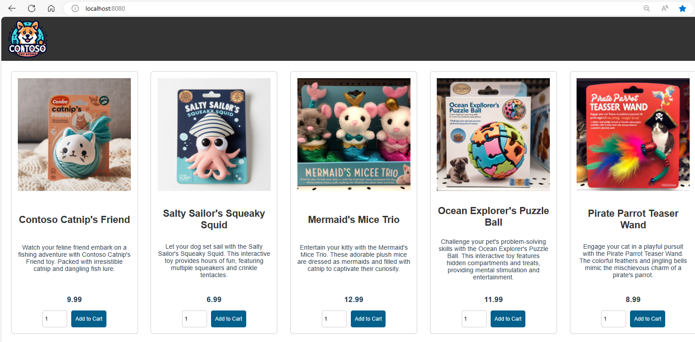

# Edge proxy Nginx

This hands-on we will deploy a Nginx Edge proxy in front of our k8s application

## 1. Deploy Sample microservices - by Azure

- Use sample microservices app for AKS demos, tutorials, and experiments: https://github.com/Azure-Samples/aks-store-demo/blob/main/aks-store-quickstart.yaml

```bash
# Deploy on demo namespace
kubectl create ns edge-proxy-demo
kubectl apply -f https://raw.githubusercontent.com/Azure-Samples/aks-store-demo/main/aks-store-quickstart.yaml -n edge-proxy-demo

# Check
kubectl get all -n edge-proxy-demo
```

## 2. Deploy edge proxy

```bash
kubectl apply -f hands-on/k8s-edge-proxy/nginx-edge-proxy.yaml

# Verify
kubectl get svc
```

## 3. Access the proxy

- Forward port

```bash
kubectl port-forward svc/nginx-ingress 8080:80
```

- We now can asccess: http://localhost:8080

- Result
  

## 4. Clean up

```bash
# Cleanup Nginx Edge proxy
kubectl apply -f hands-on/k8s-edge-proxy/nginx-edge-proxy.yaml

# Clean up app
kubectl Delete -f https://raw.githubusercontent.com/Azure-Samples/aks-store-demo/main/aks-store-quickstart.yaml -n edge-proxy-demo
```
